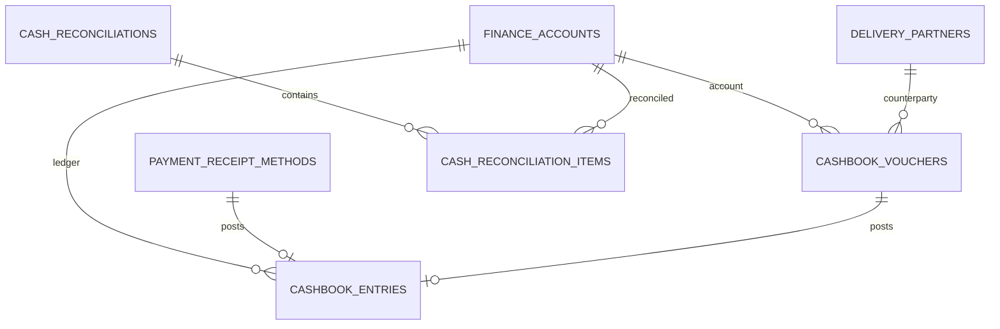

# CASHBOOK-TABLES — Sổ quỹ, phiếu thu/chi và đối soát

> **Nguồn:** `CASHBOOK.md`, `PAYMENT-DEBT-TABLES.md`

---

## 1. Phạm vi

Tài liệu này là Source of Truth dữ liệu cho Cashbook MVP:

- phiếu thu/chi thủ công ngoài POS
- dòng sổ quỹ chính thức theo từng quỹ/tài khoản
- đối soát cuối ngày theo tiền mặt và từng tài khoản ngân hàng
- sửa phiếu bằng phiên bản mới `MaCu.01`

Bảng quỹ/tài khoản `finance_accounts` đã được định nghĩa tại [PAYMENT-DEBT-TABLES.md](./PAYMENT-DEBT-TABLES.md).

Không chốt trong file này:

- quy trình duyệt nhiều bước
- kế toán tổng hợp nâng cao
- tự động đối soát ngân hàng qua API ngân hàng

---

## 2. Quy ước chung

`cashbook_entries` là sổ quỹ chính thức để tính số dư hiệu lực.

Nguồn sinh dòng sổ quỹ trong MVP:

- `payment_receipt_methods`: tiền thu từ POS hoặc thu nợ
- `cashbook_vouchers`: phiếu thu/chi thủ công

Phiếu hoặc nguồn bị `cancelled` không được tính vào số dư hiệu lực. Khi cần sửa, không sửa đè dòng cũ; tạo bản mới theo quy tắc `MaCu.01`.

---

## 3. Bảng `public.cashbook_vouchers` — Phiếu thu/chi thủ công

### Mục đích

Lưu phiếu thu/chi được nhập trực tiếp trong Sổ quỹ, không phát sinh từ thanh toán POS hoặc thu nợ.

Phiếu sinh từ POS/thu nợ dùng `payment_receipts` làm chứng từ gốc, không nhập lại vào bảng này để tránh trùng tiền.

### Các cột

| Tên cột | Kiểu dữ liệu | Nullable | Mô tả |
|---|---|---|---|
| `id` | `uuid` | ❌ | Khóa chính |
| `organization_id` | `uuid` | ❌ | FK → `public.organizations.id` |
| `code` | `text` | ❌ | Mã phiếu, ví dụ `PT000123`, `PC000045` |
| `base_code` | `text` | ❌ | Mã gốc của chuỗi sửa phiếu |
| `revision_no` | `integer` | ❌ | Bản gốc là `0`, bản sửa đầu là `1` |
| `voucher_direction` | `text` | ❌ | `in` hoặc `out` |
| `voucher_type` | `text` | ❌ | Loại thu/chi |
| `status` | `text` | ❌ | `posted` hoặc `cancelled` |
| `finance_account_id` | `uuid` | ❌ | FK → `public.finance_accounts.id` |
| `amount` | `numeric(12,0)` | ❌ | Số tiền phiếu |
| `is_business_accounted` | `boolean` | ❌ | Có tính vào báo cáo kết quả kinh doanh không |
| `counterparty_type` | `text` | ❌ | `customer`, `supplier`, `employee`, `delivery_partner`, `other`, `none` |
| `counterparty_id` | `uuid` | ✅ | Id bản ghi master data tương ứng với `counterparty_type`; bắt buộc nếu không phải `other`/`none` |
| `counterparty_name` | `text` | ✅ | Snapshot tên người nộp/nhận tại thời điểm ghi phiếu; với `other` là text tự do |
| `counterparty_phone` | `text` | ✅ | Snapshot số điện thoại người nộp/nhận nếu có |
| `partner_debt_mode` | `text` | ❌ | `affects_partner_debt`, `not_affect_partner_debt`, `no_partner_debt` |
| `transfer_group_id` | `uuid` | ✅ | Nhóm liên kết cặp chuyển/rút nếu có |
| `transfer_counterpart_voucher_id` | `uuid` | ✅ | Phiếu đối ứng của chuyển/rút nếu có |
| `related_order_id` | `uuid` | ✅ | FK → `public.orders.id` nếu có liên quan |
| `related_customer_id` | `uuid` | ✅ | FK → `public.customers.id` nếu có liên quan |
| `revised_from_voucher_id` | `uuid` | ✅ | FK → `public.cashbook_vouchers.id`; phiếu cũ gần nhất nếu là bản sửa |
| `replaced_by_voucher_id` | `uuid` | ✅ | FK → `public.cashbook_vouchers.id`; phiếu mới thay thế nếu bị hủy do sửa |
| `reason` | `text` | ✅ | Lý do thu/chi |
| `cancel_reason` | `text` | ✅ | Lý do hủy nếu người dùng hủy phiếu |
| `cancelled_by` | `uuid` | ✅ | FK → `public.profiles.id`; người hủy |
| `cancelled_at` | `timestamptz` | ✅ | Thời điểm hủy |
| `created_by` | `uuid` | ❌ | FK → `public.profiles.id` |
| `created_at` | `timestamptz` | ❌ | Thời điểm tạo |
| `updated_at` | `timestamptz` | ❌ | Thời điểm cập nhật gần nhất |

### `voucher_type`

| Giá trị | Hướng | Ý nghĩa |
|---|---|---|
| `other_income` | `in` | Thu khác |
| `capital_contribution` | `in` | Góp vốn |
| `transfer` | `in/out` | Chuyển/Rút giữa quỹ/tài khoản |
| `material_purchase` | `out` | Chi mua vật tư |
| `supplier_payment` | `out` | Chi trả nhà cung cấp |
| `staff_salary` | `out` | Chi lương nhân viên |
| `shipping_expense` | `out` | Chi vận chuyển |
| `customer_refund` | `out` | Chi hoàn tiền cho khách |
| `operating_expense` | `out` | Chi phí vận hành |
| `tax_or_vat` | `out` | Nộp thuế/chuyển VAT cho khách |
| `commission` | `out` | Hoa hồng |
| `other_expense` | `out` | Chi khác |

Thu bán hàng và thu nợ khách không dùng `cashbook_vouchers`; nguồn chuẩn là `payment_receipts`.

### Ràng buộc

- `UNIQUE (organization_id, code)`
- `voucher_direction IN ('in', 'out')`
- `voucher_type IN ('other_income', 'capital_contribution', 'transfer', 'material_purchase', 'supplier_payment', 'staff_salary', 'shipping_expense', 'customer_refund', 'operating_expense', 'tax_or_vat', 'commission', 'other_expense')`
- `counterparty_type IN ('customer', 'supplier', 'employee', 'delivery_partner', 'other', 'none')`
- `partner_debt_mode IN ('affects_partner_debt', 'not_affect_partner_debt', 'no_partner_debt')`
- `status IN ('posted', 'cancelled')`
- `amount > 0`
- `finance_account_id` phải cùng `organization_id`.
- Nếu `voucher_direction = 'in'`, `code` dùng prefix `PT`.
- Nếu `voucher_direction = 'out'`, `code` dùng prefix `PC`.
- Các loại thu phải có `voucher_direction = 'in'`.
- Các loại chi phải có `voucher_direction = 'out'`.
- `transfer` được phép `in` hoặc `out`, nhưng khi làm luồng điều chuyển đủ phải có cặp phiếu liên kết trong cùng transaction nghiệp vụ.
- Nếu `voucher_type = 'transfer'` và tạo bằng luồng điều chuyển đủ, `transfer_group_id` và `transfer_counterpart_voucher_id` bắt buộc sau khi transaction hoàn tất.
- Với bản gốc, `revision_no = 0`, `code = base_code`, `revised_from_voucher_id` null.
- Với bản sửa, `revision_no > 0`, `code = base_code || '.' || LPAD(revision_no, 2, '0')`, `revised_from_voucher_id` bắt buộc.
- Phiếu `cancelled` không được tính vào số dư hiệu lực.
- Nếu `status = 'cancelled'` do người dùng hủy, `cancel_reason`, `cancelled_by`, `cancelled_at` bắt buộc.
- Nếu `status = 'cancelled'` do sửa phiếu, `replaced_by_voucher_id` bắt buộc.
- Nếu `counterparty_type IN ('customer', 'supplier', 'employee', 'delivery_partner')`, `counterparty_id` bắt buộc.
- Nếu `counterparty_type = 'other'`, `counterparty_id` phải null và `counterparty_name` bắt buộc.
- Nếu `counterparty_type = 'none'`, `counterparty_id`, `counterparty_name`, `counterparty_phone` phải null trừ khi dữ liệu legacy/import cần preserve text nguồn.
- Với `customer`, `counterparty_id` tham chiếu `public.customers.id`.
- Với `supplier`, `counterparty_id` tham chiếu `public.suppliers.id`.
- Với `employee`, `counterparty_id` tham chiếu `public.profiles.id`.
- Với `delivery_partner`, `counterparty_id` tham chiếu `public.delivery_partners.id`.
- `counterparty_name` và `counterparty_phone` luôn là snapshot lịch sử, không tự đổi khi master data đổi sau này.

### Index

- `idx_cashbook_vouchers_org_status_created` trên `(organization_id, status, created_at DESC)`
- `idx_cashbook_vouchers_account` trên `(organization_id, finance_account_id, created_at DESC)`
- `idx_cashbook_vouchers_base_revision` trên `(organization_id, base_code, revision_no)`
- `idx_cashbook_vouchers_counterparty` trên `(organization_id, counterparty_type, counterparty_id)` với điều kiện `counterparty_id IS NOT NULL`

---

## 4. Bảng `public.delivery_partners` — Đối tác giao hàng

### Mục đích

Lưu danh sách đối tác giao hàng dùng cho phiếu chi vận chuyển và các phiếu thu/chi có liên quan. Đây là master data nhẹ để gợi ý/chọn nhanh, không phải màn logistics đầy đủ.

### Các cột

| Tên cột | Kiểu dữ liệu | Nullable | Mô tả |
|---|---|---|---|
| `id` | `uuid` | ❌ | Khóa chính |
| `organization_id` | `uuid` | ❌ | FK → `public.organizations.id` |
| `name` | `text` | ❌ | Tên đối tác giao hàng |
| `normalized_name` | `text` | ❌ | Tên đã chuẩn hóa để tìm/chống trùng |
| `phone` | `text` | ✅ | Số điện thoại nếu có |
| `normalized_phone` | `text` | ✅ | Số điện thoại đã chuẩn hóa |
| `note` | `text` | ✅ | Ghi chú |
| `is_active` | `boolean` | ❌ | Còn dùng để gợi ý hay không |
| `created_by` | `uuid` | ❌ | FK → `public.profiles.id` |
| `created_at` | `timestamptz` | ❌ | Thời điểm tạo |
| `updated_at` | `timestamptz` | ❌ | Thời điểm cập nhật |

### Ràng buộc

- `name` không rỗng sau trim.
- Nếu có `normalized_phone`, chống trùng trong cùng organization theo `(organization_id, normalized_phone)`.
- Nếu không có phone, chống trùng active theo `(organization_id, normalized_name)`.
- Tạo nhanh từ phiếu thu/chi phải upsert/gộp theo `normalized_phone` nếu có; nếu không có phone thì theo `normalized_name`.
- Không xóa vật lý đối tác đã từng được voucher tham chiếu; chỉ chuyển `is_active = false`.

### Index

- `idx_delivery_partners_org_active_name` trên `(organization_id, is_active, normalized_name)`
- `idx_delivery_partners_org_phone` trên `(organization_id, normalized_phone)` với điều kiện `normalized_phone IS NOT NULL`

---

## 5. Bảng `public.cashbook_entries` — Dòng sổ quỹ chính thức

### Mục đích

Ghi từng dòng tăng/giảm tiền theo từng quỹ/tài khoản.

Đây là bảng dùng để tính số dư hệ thống khi xem sổ quỹ và khi đối soát cuối ngày.

### Các cột

| Tên cột | Kiểu dữ liệu | Nullable | Mô tả |
|---|---|---|---|
| `id` | `uuid` | ❌ | Khóa chính |
| `organization_id` | `uuid` | ❌ | FK → `public.organizations.id` |
| `finance_account_id` | `uuid` | ❌ | FK → `public.finance_accounts.id` |
| `entry_time` | `timestamptz` | ❌ | Thời điểm ghi sổ |
| `source_type` | `text` | ❌ | `payment_receipt_method` hoặc `cashbook_voucher` |
| `payment_receipt_method_id` | `uuid` | ✅ | FK → `public.payment_receipt_methods.id` nếu thu từ POS/thu nợ |
| `cashbook_voucher_id` | `uuid` | ✅ | FK → `public.cashbook_vouchers.id` nếu phiếu thủ công |
| `status` | `text` | ❌ | `posted` hoặc `cancelled` |
| `direction` | `text` | ❌ | `in` hoặc `out` |
| `amount_delta` | `numeric(12,0)` | ❌ | Số tiền tăng dương, giảm âm |
| `is_business_accounted` | `boolean` | ❌ | Có tính vào báo cáo kết quả kinh doanh không |
| `running_balance` | `numeric(12,0)` | ✅ | Số dư sau dòng; có thể tính lại nếu cần |
| `description` | `text` | ✅ | Mô tả hiển thị trên sổ quỹ |
| `created_by` | `uuid` | ❌ | FK → `public.profiles.id` |
| `created_at` | `timestamptz` | ❌ | Thời điểm tạo |

### Ràng buộc

- `source_type IN ('payment_receipt_method', 'cashbook_voucher')`
- `status IN ('posted', 'cancelled')`
- `direction IN ('in', 'out')`
- Nếu `direction = 'in'`, `amount_delta > 0`.
- Nếu `direction = 'out'`, `amount_delta < 0`.
- Nếu `source_type = 'payment_receipt_method'`, `payment_receipt_method_id` bắt buộc và `cashbook_voucher_id` null.
- Nếu `source_type = 'cashbook_voucher'`, `cashbook_voucher_id` bắt buộc và `payment_receipt_method_id` null.
- `finance_account_id` phải khớp tài khoản của nguồn gốc.
- Mỗi `payment_receipt_method_id` tạo tối đa một dòng `cashbook_entries`.
- Mỗi `cashbook_voucher_id` tạo tối đa một dòng `cashbook_entries`.
- Chỉ dòng `status = 'posted'` được tính vào số dư hiệu lực.
- Khi nguồn gốc bị `cancelled`, dòng sổ quỹ tương ứng cũng chuyển `status = 'cancelled'`, không xóa vật lý.

### Index

- `idx_cashbook_entries_account_time` trên `(organization_id, finance_account_id, status, entry_time DESC)`
- `idx_cashbook_entries_payment_method` trên `(organization_id, payment_receipt_method_id)` với điều kiện `payment_receipt_method_id IS NOT NULL`
- `idx_cashbook_entries_voucher` trên `(organization_id, cashbook_voucher_id)` với điều kiện `cashbook_voucher_id IS NOT NULL`

---

## 6. Bảng `public.cash_reconciliations` — Phiên đối soát

### Mục đích

Lưu một phiên đối soát cuối ngày hoặc theo ca.

Đối soát được thực hiện theo từng quỹ/tài khoản ở bảng `cash_reconciliation_items`.

### Các cột

| Tên cột | Kiểu dữ liệu | Nullable | Mô tả |
|---|---|---|---|
| `id` | `uuid` | ❌ | Khóa chính |
| `organization_id` | `uuid` | ❌ | FK → `public.organizations.id` |
| `code` | `text` | ❌ | Mã phiên đối soát, ví dụ `DS000001` |
| `status` | `text` | ❌ | `draft`, `balanced`, `cancelled` |
| `period_start` | `timestamptz` | ❌ | Từ thời điểm |
| `period_end` | `timestamptz` | ❌ | Đến thời điểm |
| `balanced_at` | `timestamptz` | ✅ | Thời điểm chốt đối soát |
| `note` | `text` | ✅ | Ghi chú phiên |
| `created_by` | `uuid` | ❌ | FK → `public.profiles.id` |
| `created_at` | `timestamptz` | ❌ | Thời điểm tạo |
| `updated_at` | `timestamptz` | ❌ | Thời điểm cập nhật gần nhất |

### Ràng buộc

- `UNIQUE (organization_id, code)`
- `status IN ('draft', 'balanced', 'cancelled')`
- `period_start < period_end`
- Nếu `status = 'balanced'`, `balanced_at` không null.
- Nếu `status != 'balanced'`, `balanced_at` null.
- Phiên đối soát không xóa vật lý.

### Index

- `idx_cash_reconciliations_org_status_period` trên `(organization_id, status, period_end DESC)`

---

## 7. Bảng `public.cash_reconciliation_items` — Dòng đối soát

### Mục đích

Lưu số hệ thống, số thực tế và chênh lệch theo từng quỹ/tài khoản.

### Các cột

| Tên cột | Kiểu dữ liệu | Nullable | Mô tả |
|---|---|---|---|
| `id` | `uuid` | ❌ | Khóa chính |
| `organization_id` | `uuid` | ❌ | FK → `public.organizations.id` |
| `cash_reconciliation_id` | `uuid` | ❌ | FK → `public.cash_reconciliations.id` |
| `line_no` | `integer` | ❌ | Số thứ tự dòng |
| `finance_account_id` | `uuid` | ❌ | FK → `public.finance_accounts.id` |
| `system_balance` | `numeric(12,0)` | ❌ | Số dư hệ thống tại thời điểm đối soát |
| `actual_balance` | `numeric(12,0)` | ❌ | Số thực tế trong két/tài khoản |
| `difference_amount` | `numeric(12,0)` | ❌ | `actual_balance - system_balance` |
| `note` | `text` | ✅ | Ghi chú chênh lệch |
| `created_at` | `timestamptz` | ❌ | Thời điểm tạo |

### Ràng buộc

- `UNIQUE (cash_reconciliation_id, line_no)`
- `UNIQUE (cash_reconciliation_id, finance_account_id)`
- `cash_reconciliation_id` phải cùng `organization_id`.
- `finance_account_id` phải cùng `organization_id`.
- `difference_amount = actual_balance - system_balance`

### Index

- `idx_cash_reconciliation_items_reconciliation` trên `(organization_id, cash_reconciliation_id, line_no)`
- `idx_cash_reconciliation_items_account` trên `(organization_id, finance_account_id)`

---

## 8. Luồng dữ liệu MVP

### Thu từ POS/thu nợ

1. POS hoặc thu nợ tạo `payment_receipts`.
2. Mỗi dòng `payment_receipt_methods` tạo một dòng `cashbook_entries`.
3. Nếu thanh toán kết hợp tiền mặt và chuyển khoản, sổ quỹ có hai dòng riêng.

### Thu/chi thủ công

1. Nhân viên có quyền tài chính tạo `cashbook_vouchers`.
2. Hệ thống tạo một dòng `cashbook_entries` tương ứng.
3. Nếu sửa phiếu, phiếu cũ `cancelled`, phiếu mới dùng mã `MaCu.01`; sổ quỹ chỉ tính bản còn hiệu lực.

### Đối soát cuối ngày

1. Tạo `cash_reconciliations` ở trạng thái `draft`.
2. Hệ thống tính `system_balance` từ các dòng `cashbook_entries.status = 'posted'` cho từng `finance_account`.
3. Nhân viên nhập `actual_balance` theo tiền mặt trong két và từng tài khoản ngân hàng.
4. Hệ thống tính `difference_amount`.
5. Khi chốt, trạng thái chuyển `balanced`.

---

## 8A. KiotViet So Quy Import - current direction 2026-07-13

Source file checked in Downloads:

- `SoQuy_KV24062026-181948-016.xlsx`
- 205 valid rows / 209 raw rows
- Columns: `Ma phieu`, `Thoi gian`, `Nguoi tao`, `Nhan vien`, `Loai thu chi`, `Ten tai khoan`, `So tai khoan`, `Ma nguoi nop/nhan`, `Nguoi nop/nhan`, `So dien thoai`, `Gia tri`, `Loai so quy`, `Trang thai`

Observed KiotViet data:

| Field | Values seen |
|---|---|
| `Loai so quy` | `Tien mat` 96 rows, `Ngan hang` 109 rows |
| `Trang thai` | `Da thanh toan` 204 rows, `Da huy` 1 row |
| Cash account fields | `Ten tai khoan` and `So tai khoan` blank |
| Bank account fields | Filled by KiotViet account name and number |

Finance account import rule:

- Rows with `Loai so quy = Tien mat` map to one default cash account. Blank `Ten tai khoan` / `So tai khoan` is valid for cash.
- Rows with `Loai so quy = Ngan hang` map to bank accounts by normalized pair `(Ten tai khoan, So tai khoan)`.
- `finance_accounts` must be a real persisted table/repository. Do not store account choices as UI-only JSON or hard-coded constants.
- Imported account rows should preserve KiotViet display name and account number so later cashbook/debt screens can filter by the same account seen in KV.

Cashbook row import rule:

- Use `Ma phieu` as source key for KiotViet import.
- `Thoi gian` maps to `cashbook_entries.entry_time`.
- `Gia tri > 0` maps to `direction = in`; `Gia tri < 0` maps to `direction = out`.
- Store absolute voucher amount where a voucher record is created; keep signed delta in `cashbook_entries.amount_delta`.
- `Trang thai = Da thanh toan` maps to `posted`; `Trang thai = Da huy` maps to `cancelled`.
- `Loai thu chi` maps to cashbook category/voucher type. Unknown categories should be preserved as source text instead of dropped.
- `Ma nguoi nop/nhan`, `Nguoi nop/nhan`, and `So dien thoai` are counterparty source fields. KiotViet So Quy export does not provide an explicit counterparty type column. QCVL must infer `counterparty_type` only from reliable matches: `KH...`/customer code to customer, `NCC...`/supplier code to supplier, or exact trusted catalog match; otherwise keep `other` and preserve source text.
- Imported KiotViet historical rows must be traceable with `source_system = kiotviet` and source code/file metadata. Manual QCVL rows and POS-generated rows must not overwrite imported KV rows.

Implementation order:

1. Build persisted finance account repository/API on local `3202`.
2. Add parser tests for `SoQuy_KV*.xlsx`.
3. Add preview/import/delete-old import flow for KiotViet cashbook.
4. Verify totals by filter against KiotViet before promoting to NAS.

---

## 9. ERD tóm tắt

---

← [Quay về Finance README](./README.md)
