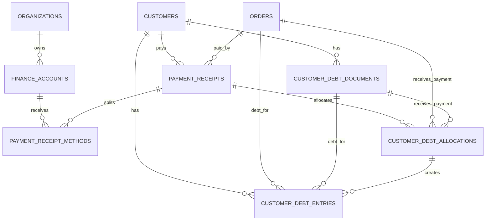

# PAYMENT-DEBT-TABLES — Thanh toán POS và công nợ

> **Nguồn:** `POS-CHECKOUT.md`, `POS-CUSTOMER-DEBT.md`, `CASHBOOK.md`

---

## 1. Phạm vi

Tài liệu này là Source of Truth dữ liệu cho Payment + Debt MVP:

- quỹ tiền mặt và tài khoản ngân hàng nhận tiền
- một lần thu tiền từ POS hoặc thu nợ
- tách tiền mặt/chuyển khoản trong một lần thu
- công nợ theo từng hóa đơn
- phiếu điều chỉnh công nợ `CB...`
- phiếu chiết khấu thanh toán `CKKH...`
- phân bổ tiền trả nợ vào hóa đơn cũ nhất trước

Không chốt trong file này:

- phiếu chi chi tiết
- đối soát cuối ngày chi tiết
- báo cáo tài chính nâng cao
- module khách trả trước/số dư có lợi vận hành

Tổng công nợ khách hàng hiển thị runtime lấy theo công thức canonical ở [Business Finance CUSTOMER-DEBT.md](../../03-BUSINESS-NghiepVu/Finance/CUSTOMER-DEBT.md). Các bảng dưới đây là nguồn ledger/payment; không màn nào được tự dùng một bảng đơn lẻ làm tổng chính.

Với khách hàng liên kết nhà cung cấp, Finance phải dùng cùng quy tắc view đảo dấu đã chốt ở Business Finance/Purchase. Một chứng từ chỉ ghi một lần vào ledger quan hệ đối tác; view khách hàng và view NCC hiển thị dấu ngược nhau, không cộng chồng thành hai khoản độc lập.

Business Rule liên quan:

- [POS-CHECKOUT.md](../../03-BUSINESS-NghiepVu/Sales/POS-CHECKOUT.md)
- [CUSTOMER-DEBT.md](../../03-BUSINESS-NghiepVu/Finance/CUSTOMER-DEBT.md)
- [POS-CUSTOMER-DEBT.md](../../03-BUSINESS-NghiepVu/Sales/POS-CUSTOMER-DEBT.md)
- [CASHBOOK.md](../../03-BUSINESS-NghiepVu/Finance/CASHBOOK.md)

---

## 2. Quy ước chung

Tất cả bảng Finance đều có `organization_id`.

MVP không lưu khách trả trước. Nếu khách trả dư sau khi cấn hết nợ cũ, phần dư là tiền thừa trả lại khách và được lưu ở `orders.change_returned_amount`.

Một lần thanh toán POS chỉ có tối đa một tài khoản ngân hàng cho phần chuyển khoản, nhưng có thể gồm tiền mặt + chuyển khoản.

---

## 3. Bảng `public.finance_accounts` — Quỹ/tài khoản

### Mục đích

Lưu quỹ tiền mặt và tài khoản ngân hàng để ghi nhận tiền vào/ra đúng nơi.

### Các cột

| Tên cột | Kiểu dữ liệu | Nullable | Mô tả |
|---|---|---|---|
| `id` | `uuid` | ❌ | Khóa chính |
| `organization_id` | `uuid` | ❌ | FK → `public.organizations.id` |
| `code` | `text` | ❌ | Mã quỹ/tài khoản, ví dụ `CASH`, `MB01` |
| `name` | `text` | ❌ | Tên hiển thị |
| `account_type` | `text` | ❌ | `cash` hoặc `bank` |
| `bank_name` | `text` | ✅ | Tên ngân hàng nếu là `bank` |
| `bank_account_no` | `text` | ✅ | Số tài khoản nếu là `bank` |
| `is_default_cash` | `boolean` | ❌ | Quỹ tiền mặt mặc định |
| `is_active` | `boolean` | ❌ | Còn sử dụng |
| `created_at` | `timestamptz` | ❌ | Thời điểm tạo |
| `updated_at` | `timestamptz` | ❌ | Thời điểm cập nhật gần nhất |

### Ràng buộc

- `UNIQUE (organization_id, code)`
- `account_type IN ('cash', 'bank')`
- `name` không được rỗng sau khi trim.
- Nếu `account_type = 'cash'`, `bank_name` và `bank_account_no` null.
- Nếu `account_type = 'bank'`, `bank_name` không được rỗng.
- Mỗi organization có tối đa một quỹ tiền mặt mặc định đang active.

### Index

- `idx_finance_accounts_org_type_active` trên `(organization_id, account_type, is_active)`

---

## 4. Bảng `public.payment_receipts` — Một lần thu tiền

### Mục đích

Lưu một lần thu tiền từ thanh toán POS, thu nợ khách hoặc thu khác.

Phiếu này là đầu mối để nối Sales, Debt và Cashbook. Chi tiết dòng tiền mặt/chuyển khoản nằm ở `payment_receipt_methods`.

### Các cột

| Tên cột | Kiểu dữ liệu | Nullable | Mô tả |
|---|---|---|---|
| `id` | `uuid` | ❌ | Khóa chính |
| `organization_id` | `uuid` | ❌ | FK → `public.organizations.id` |
| `code` | `text` | ❌ | Mã phiếu thu, ví dụ `PT000001` |
| `base_code` | `text` | ❌ | Mã gốc của chuỗi sửa phiếu |
| `revision_no` | `integer` | ❌ | Bản gốc là `0`, bản sửa đầu là `1` |
| `status` | `text` | ❌ | `posted` hoặc `cancelled` |
| `receipt_type` | `text` | ❌ | `sale_payment`, `debt_collection`, `mixed_sale_and_debt` |
| `customer_id` | `uuid` | ✅ | FK → `public.customers.id`; phiếu từ POS khách lẻ dùng `khachle`, không tạo bucket null |
| `order_id` | `uuid` | ✅ | FK → `public.orders.id`; hóa đơn mới nếu có |
| `total_received_amount` | `numeric(12,0)` | ❌ | Tổng tiền thực giữ lại và ghi quỹ |
| `sale_payment_amount` | `numeric(12,0)` | ❌ | Phần áp vào hóa đơn mới |
| `debt_collection_amount` | `numeric(12,0)` | ❌ | Phần dùng để trả nợ cũ |
| `change_returned_amount` | `numeric(12,0)` | ❌ | Tiền thừa trả lại khách nếu có |
| `revised_from_receipt_id` | `uuid` | ✅ | FK → `public.payment_receipts.id`; phiếu cũ gần nhất nếu là bản sửa |
| `replaced_by_receipt_id` | `uuid` | ✅ | FK → `public.payment_receipts.id`; phiếu mới thay thế nếu bị hủy do sửa |
| `note` | `text` | ✅ | Ghi chú |
| `created_by` | `uuid` | ❌ | FK → `public.profiles.id` |
| `created_at` | `timestamptz` | ❌ | Thời điểm tạo |
| `updated_at` | `timestamptz` | ❌ | Thời điểm cập nhật gần nhất |

### Ràng buộc

- `UNIQUE (organization_id, code)`
- `status IN ('posted', 'cancelled')`
- `receipt_type IN ('sale_payment', 'debt_collection', 'mixed_sale_and_debt')`
- `revision_no >= 0`
- `total_received_amount >= 0`
- `sale_payment_amount >= 0`
- `debt_collection_amount >= 0`
- `change_returned_amount >= 0`
- `total_received_amount = sale_payment_amount + debt_collection_amount`
- `change_returned_amount` chỉ là tiền trả lại khách, không ghi tăng quỹ.
- Nếu `receipt_type = 'sale_payment'`, `order_id` bắt buộc và `sale_payment_amount > 0`.
- Nếu `receipt_type = 'debt_collection'`, `customer_id` bắt buộc và `debt_collection_amount > 0`.
- Nếu `receipt_type = 'mixed_sale_and_debt'`, `order_id` và `customer_id` bắt buộc, `sale_payment_amount > 0`, `debt_collection_amount > 0`.
- Nếu thu từ hóa đơn khách lẻ, `customer_id` là khách mặc định `khachle`.
- Nếu `status = 'cancelled'`, phiếu không được tính vào số dư hiệu lực.
- Với bản gốc, `revision_no = 0`, `code = base_code`, `revised_from_receipt_id` null.
- Với bản sửa, `revision_no > 0`, `code = base_code || '.' || LPAD(revision_no, 2, '0')`, `revised_from_receipt_id` bắt buộc.

### Index

- `idx_payment_receipts_org_status_created` trên `(organization_id, status, created_at DESC)`
- `idx_payment_receipts_customer` trên `(organization_id, customer_id, created_at DESC)` với điều kiện `customer_id IS NOT NULL`
- `idx_payment_receipts_order` trên `(organization_id, order_id)` với điều kiện `order_id IS NOT NULL`
- `idx_payment_receipts_base_revision` trên `(organization_id, base_code, revision_no)`

---

## 5. Bảng `public.payment_receipt_methods` — Dòng phương thức thu

### Mục đích

Tách một lần thu thành dòng tiền mặt và/hoặc chuyển khoản vào đúng quỹ/tài khoản.

### Các cột

| Tên cột | Kiểu dữ liệu | Nullable | Mô tả |
|---|---|---|---|
| `id` | `uuid` | ❌ | Khóa chính |
| `organization_id` | `uuid` | ❌ | FK → `public.organizations.id` |
| `payment_receipt_id` | `uuid` | ❌ | FK → `public.payment_receipts.id` |
| `line_no` | `integer` | ❌ | Số thứ tự dòng |
| `finance_account_id` | `uuid` | ❌ | FK → `public.finance_accounts.id` |
| `method_type` | `text` | ❌ | `cash` hoặc `bank_transfer` |
| `amount` | `numeric(12,0)` | ❌ | Số tiền theo phương thức này |
| `bank_transaction_ref` | `text` | ✅ | Mã giao dịch/chú thích chuyển khoản nếu có |
| `note` | `text` | ✅ | Ghi chú dòng |
| `created_at` | `timestamptz` | ❌ | Thời điểm tạo |

### Ràng buộc

- `UNIQUE (payment_receipt_id, line_no)`
- `method_type IN ('cash', 'bank_transfer')`
- `amount > 0`
- `finance_account_id` phải cùng `organization_id`.
- Nếu `method_type = 'cash'`, `finance_account_id.account_type = 'cash'`.
- Nếu `method_type = 'bank_transfer'`, `finance_account_id.account_type = 'bank'`.
- Mỗi `payment_receipt_id` có tối đa một dòng `cash` và tối đa một dòng `bank_transfer` trong MVP.
- Tổng `amount` của các dòng phải bằng `payment_receipts.total_received_amount`.
- Tiền thừa trả lại khách không tạo dòng `payment_receipt_methods`.

### Index

- `idx_payment_receipt_methods_receipt` trên `(organization_id, payment_receipt_id, line_no)`
- `idx_payment_receipt_methods_account` trên `(organization_id, finance_account_id)`

---

## 6. Bảng `public.customer_debt_documents` — Chứng từ công nợ hiệu lực

### Mục đích

Lưu các chứng từ làm tăng/giảm công nợ khách theo cách chuẩn, gồm dữ liệu QCVL tạo mới và chứng từ chuẩn hóa từ KiotViet.

Import KiotViet không phải mốc khóa công thức. Sau import, chứng từ KV là chứng từ QCVL bình thường: có thể thu, sửa bằng revision, hủy theo quyền/audit và được tính theo trạng thái hiệu lực.

### Các loại chứng từ

| Loại | Ví dụ mã nguồn | Ảnh hưởng công nợ |
|---|---|---|
| `invoice_debt` | `HD...` | Tăng nợ theo số còn phải thu |
| `debt_adjustment_increase` | `CB...` | Tăng nợ nếu phiếu điều chỉnh làm khách nợ thêm |
| `debt_adjustment_decrease` | `CB...` | Giảm nợ nếu phiếu điều chỉnh làm giảm nợ |
| `payment_discount` | `CKKH...` | Giảm nợ như chiết khấu thanh toán |

### View đối tác liên kết KH-NCC

| Mã phiếu / nghiệp vụ | View khách hàng | View NCC liên kết |
|---|---:|---:|
| `HD...`, `HDO...` | `+` | `-` |
| `TT...`, `TTHD...`, `TTHDO...`, `TTM...`, `TTMHD...`, `TNH...`, `TNHHD...` | `-` | `+` |
| `CKKH...` | `-` | `+` |
| `CB...` | `+/-` theo phiếu | đảo dấu |
| `PN...` | `-` | `+` |
| `PCPN...`, `PC...` | `+` | `-` |

DB có thể lưu ledger canonical theo một chiều nội bộ, nhưng API/UI phải trả đúng dấu theo view đang xem. Không được lưu riêng hai dòng độc lập rồi cộng cả hai vào tổng.

### Trường bắt buộc tối thiểu

| Tên cột | Kiểu dữ liệu | Nullable | Mô tả |
|---|---|---|---|
| `id` | `uuid` | ❌ | Khóa chính |
| `organization_id` | `uuid` | ❌ | FK → `public.organizations.id` |
| `customer_id` | `uuid` | ❌ | FK → `public.customers.id` |
| `source_code` | `text` | ❌ | Mã chứng từ hiển thị/đối soát, giữ nguyên `HD...`, `CB...`, `CKKH...` nếu import |
| `document_type` | `text` | ❌ | Một trong các loại ở bảng trên |
| `source_system` | `text` | ✅ | `qcvl`, `kiotviet`, hoặc nguồn khác nếu có |
| `status` | `text` | ❌ | `posted`, `cancelled`, `replaced` |
| `document_time` | `timestamptz` | ❌ | Thời gian nghiệp vụ của chứng từ |
| `original_amount` | `numeric(12,0)` | ❌ | Số phát sinh gốc |
| `remaining_amount` | `numeric(12,0)` | ❌ | Số còn hiệu lực chưa được thu/cấn/hết hiệu lực |
| `revised_from_document_id` | `uuid` | ✅ | Chứng từ cũ nếu là bản sửa |
| `replaced_by_document_id` | `uuid` | ✅ | Chứng từ mới thay thế nếu bản này bị sửa |
| `note` | `text` | ✅ | Ghi chú |
| `created_at` | `timestamptz` | ❌ | Thời điểm tạo |

### Ràng buộc

- Runtime status: code đã chuyển sang canonical partner debt ledger. `balance_after` KV chỉ còn là metadata đối soát, không tham gia công thức tổng.
- `document_type IN ('invoice_debt', 'debt_adjustment_increase', 'debt_adjustment_decrease', 'payment_discount')`
- `status IN ('posted', 'cancelled', 'replaced')`
- `original_amount >= 0`
- `remaining_amount >= 0`
- Chỉ chứng từ `posted` còn hiệu lực mới được tính vào tổng công nợ.
- Với chứng từ giảm nợ (`debt_adjustment_decrease`, `payment_discount`), công thức tổng trừ `remaining_amount`.
- Không dùng `customer_snapshots.total_debt_amount` hoặc `customer_debt_adjustments.balance_after` làm tổng runtime.
- Chứng từ import KV không được sửa đè. Sửa tạo revision/bản thay thế; hủy giữ record cũ và lý do audit.

### Index

- `idx_customer_debt_documents_customer_time` trên `(organization_id, customer_id, document_time DESC)`
- `idx_customer_debt_documents_source_code` trên `(organization_id, source_code)`
- `idx_customer_debt_documents_status` trên `(organization_id, status)`

---

## 7. Bảng `public.customer_debt_entries` — Ledger công nợ

### Mục đích

Ghi biến động công nợ theo từng hóa đơn/chứng từ. Không dùng một số tổng duy nhất làm nguồn gốc.

### Các cột

| Tên cột | Kiểu dữ liệu | Nullable | Mô tả |
|---|---|---|---|
| `id` | `uuid` | ❌ | Khóa chính |
| `organization_id` | `uuid` | ❌ | FK → `public.organizations.id` |
| `customer_id` | `uuid` | ✅ | FK → `public.customers.id`; khách lẻ nợ dùng `khachle`, không dùng bucket null |
| `order_id` | `uuid` | ✅ | FK → `public.orders.id` nếu entry thuộc hóa đơn |
| `debt_document_id` | `uuid` | ✅ | FK → `public.customer_debt_documents.id` nếu entry thuộc chứng từ công nợ chuẩn |
| `entry_type` | `text` | ❌ | `invoice_debt`, `debt_payment`, `debt_reversal` |
| `amount_delta` | `numeric(12,0)` | ❌ | Tăng nợ là dương, giảm nợ là âm |
| `balance_after_order` | `numeric(12,0)` | ❌ | Nợ còn lại của hóa đơn sau giao dịch |
| `balance_after_customer` | `numeric(12,0)` | ✅ | Tổng nợ khách sau giao dịch; với khách lẻ là tổng nợ của `khachle` |
| `payment_receipt_id` | `uuid` | ✅ | FK → `public.payment_receipts.id` nếu giảm nợ do thu tiền |
| `debt_allocation_id` | `uuid` | ✅ | FK → `public.customer_debt_allocations.id` nếu có |
| `retail_debt_note` | `text` | ✅ | Ghi chú nhận diện nếu là khách lẻ nợ trên `khachle` |
| `reason` | `text` | ✅ | Lý do phát sinh/đảo |
| `created_by` | `uuid` | ❌ | FK → `public.profiles.id` |
| `created_at` | `timestamptz` | ❌ | Thời điểm tạo |

### Ràng buộc

- `entry_type IN ('invoice_debt', 'debt_payment', 'debt_reversal')`
- `amount_delta <> 0`
- `balance_after_order >= 0`
- `balance_after_customer >= 0` khi không null.
- `order_id` phải trỏ tới hóa đơn `order_type = 'invoice'` nếu không null.
- Mỗi entry phải có `order_id` hoặc `debt_document_id`.
- Runtime POS không tạo công nợ khách lẻ với `customer_id` null. Nếu hóa đơn khách lẻ còn nợ, `customer_id` là `khachle`; `retail_debt_note` dùng để nhận diện người nợ.
- `balance_after_customer` bắt buộc với mọi giao dịch runtime có khách, gồm `khachle`.
- `debt_payment` phải có `payment_receipt_id`.
- Ledger vận hành không tạo trả trước mới trong MVP. Số âm vẫn được phép xuất hiện ở tổng công nợ để đối soát dữ liệu KiotViet/import lịch sử.

### Index

- `idx_customer_debt_entries_customer_time` trên `(organization_id, customer_id, created_at DESC)` với điều kiện `customer_id IS NOT NULL`
- `idx_customer_debt_entries_order_time` trên `(organization_id, order_id, created_at DESC)`
- `idx_customer_debt_entries_receipt` trên `(organization_id, payment_receipt_id)` với điều kiện `payment_receipt_id IS NOT NULL`

---

## 8. Bảng `public.customer_debt_allocations` — Phân bổ tiền trả nợ

### Mục đích

Lưu cách một khoản thu nợ được phân bổ vào các hóa đơn còn nợ.

Mặc định hệ thống phân bổ vào hóa đơn còn nợ cũ nhất trước. Bảng này giúp kiểm tra lại tiền đã cấn vào hóa đơn nào.

### Các cột

| Tên cột | Kiểu dữ liệu | Nullable | Mô tả |
|---|---|---|---|
| `id` | `uuid` | ❌ | Khóa chính |
| `organization_id` | `uuid` | ❌ | FK → `public.organizations.id` |
| `payment_receipt_id` | `uuid` | ❌ | FK → `public.payment_receipts.id` |
| `line_no` | `integer` | ❌ | Thứ tự phân bổ |
| `customer_id` | `uuid` | ❌ | FK → `public.customers.id` |
| `order_id` | `uuid` | ✅ | FK → `public.orders.id`; hóa đơn được cấn nợ |
| `debt_document_id` | `uuid` | ✅ | FK → `public.customer_debt_documents.id`; chứng từ công nợ được cấn nợ nếu không phải hóa đơn |
| `allocated_amount` | `numeric(12,0)` | ❌ | Số tiền cấn vào hóa đơn này |
| `order_debt_before` | `numeric(12,0)` | ❌ | Nợ hóa đơn trước khi cấn |
| `order_debt_after` | `numeric(12,0)` | ❌ | Nợ hóa đơn sau khi cấn |
| `created_at` | `timestamptz` | ❌ | Thời điểm tạo |

### Ràng buộc

- `UNIQUE (payment_receipt_id, line_no)`
- `allocated_amount > 0`
- `order_debt_before > 0`
- `order_debt_after >= 0`
- `allocated_amount = order_debt_before - order_debt_after`
- `order_id` phải là hóa đơn của cùng `customer_id`, còn nợ trước khi phân bổ, nếu không null.
- Mỗi allocation phải có `order_id` hoặc `debt_document_id`.
- `debt_document_id` phải trỏ tới chứng từ cùng `customer_id`, còn nợ/giảm nợ hiệu lực trước khi phân bổ.
- Tổng `allocated_amount` theo `payment_receipt_id` phải bằng `payment_receipts.debt_collection_amount`.
- Thứ tự phân bổ mặc định theo hóa đơn còn nợ cũ nhất trước.

### Index

- `idx_customer_debt_allocations_receipt` trên `(organization_id, payment_receipt_id, line_no)`
- `idx_customer_debt_allocations_customer_order` trên `(organization_id, customer_id, order_id)`

---

## 9. Luồng dữ liệu MVP

### Thanh toán hóa đơn mới

1. Checkout tạo `orders` loại `invoice`.
2. Nếu khách có trả tiền, tạo `payment_receipts`.
3. Tạo `payment_receipt_methods` theo tiền mặt/chuyển khoản.
4. Cập nhật snapshot tiền trên `orders`: `paid_amount`, `debt_amount`, `payment_status`, `change_returned_amount`.
5. Nếu hóa đơn còn nợ, tạo `customer_debt_entries` loại `invoice_debt`.

### Trả nợ cũ

1. Tạo `payment_receipts` loại `debt_collection` hoặc `mixed_sale_and_debt`.
2. Tạo `payment_receipt_methods`.
3. Tự phân bổ vào chứng từ công nợ còn mở cũ nhất trước, ưu tiên hóa đơn cũ nhất rồi tới chứng từ điều chỉnh tăng nợ nếu có, và lưu `customer_debt_allocations`.
4. Với mỗi dòng phân bổ, tạo `customer_debt_entries` loại `debt_payment`.

### Chuẩn hóa dữ liệu KiotViet import

1. `HD...` còn nợ tạo hóa đơn/chứng từ `invoice_debt`.
2. `TT...`, `TTM...`, `TNHHD...` tạo `payment_receipts` và phân bổ vào chứng từ nợ cũ nhất trước nếu thiếu allocation thật.
3. `CB...` tạo `customer_debt_documents` loại tăng/giảm nợ theo dấu tiền nguồn.
4. `CKKH...` tạo `customer_debt_documents` loại `payment_discount`.
5. `PN...`, `PCPN...`, `PC...` thuộc NCC liên kết KH tạo ledger quan hệ liên kết theo bảng đảo dấu; không tự đưa vào khách thuần/NCC thuần.
6. Raw import metadata giữ để đối soát, nhưng tổng runtime chỉ đọc chứng từ đã chuẩn hóa và trạng thái hiệu lực.

### Sửa/hủy chứng từ

- Không sửa đè payment/debt ledger cũ.
- Nếu sửa hóa đơn làm thay đổi công nợ hoặc tiền đã thu, Finance phải tạo phiếu/giao dịch đảo hoặc bản sửa theo quy tắc `MaCu.01`.
- Phiếu `cancelled` được giữ để kiểm tra, nhưng không tính vào số dư hiệu lực.

---

## 10. ERD tóm tắt

---

← [Quay về Finance README](./README.md)
